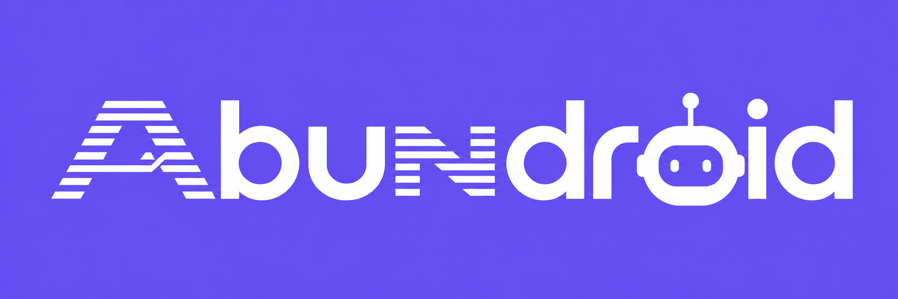

  

**Abundance Ecosystem Publication Tracker keeps one shared list of what
organizations across the ecosystem publish.** It checks approved websites and
feeds for new articles, posts, updates, announcements, and reports, then puts
those publications in a review queue.

Think of it as a set of watchlists:

- An **organization** is a publisher, such as a nonprofit, funder, or network.
- A **source** is one place that organization publishes, such as its newsroom,
  blog, or updates page.
- An **item** is one publication found there.

The tracker does the repetitive checking. People decide what is relevant,
correct the suggested title, summary, and topics, and approve or reject each
item. It never publishes without human approval and never silently overwrites
reviewed copy.

## What staff can do

Most Abundance staff use the Airtable Interface, not a terminal. They can:

- Add an organization and its website
- Pause or resume monitoring
- Add, pause, or update a publication source
- Archive an organization while keeping its past publications
- Restore an archived organization
- Review new publications and mark them approved, rejected, or duplicate

They do not need to understand feeds, database IDs, hashes, or code. A
technical deployer sets up the tracker and fixes a source when its website
changes.

## Who needs technical knowledge?

One technical deployer installs Abundroid and runs `abundroid setup` to create
the Airtable base, tables, fields, and the Hypertext example seed. The
deployer then builds the saved views and the Interface, creates the runtime
access token, stores it, and manually starts collection. Scheduled runs arrive
in Phase 4.
Routine editorial and organization-management work then happens in an Airtable
Interface and requires no terminal:

| Daily task | Where it happens |
|---|---|
| Add or edit an organization | **Organizations** form/detail page |
| Temporarily stop monitoring | **Pause** action on the organization |
| Stop monitoring but keep its history | **Archive** action |
| Bring an archived organization back | **Restore** action |
| Add or pause a blog, newsroom, feed, or updates page | Related **Sources** list |
| Review new publications | **Review Queue** in **Items** |
| See which source needs help | **Source Health** |

Permanent deletion is restricted to base administrators. Normal operators
archive instead, so previously collected Items remain available. See the
[daily operator guide](docs/SETUP.md#daily-operation).

## The data model

- **Organizations** contains one durable record per organization. An
  organization is not duplicated just because it has several places to watch.
- **Sources** contains the endpoints Abundroid checks, such as a blog feed,
  newsroom, newsletter archive, or updates page. One organization can have many.
- **Items** is the unified review stream. Filtered views provide separate
  article, update, announcement, and report queues without separate
  pipelines.
- **Source Runs** records plain-language health and errors for each collection
  attempt.
- **Topics** contains the editable keyword taxonomy used for suggestions.

The exact fields, views, and field ownership rules are in
[docs/airtable-schema.md](docs/airtable-schema.md).

## Status at a glance

**Available now:** RSS/Atom source collection, CSV and Airtable storage, topic
suggestions, stable identity, change flags, cross-run duplicate flags,
review-safe updates, failure isolation, and Source Run history.

**Planned, not yet available:** automatic feed discovery, scheduled runs,
article JSON-LD and plain-HTML extraction, and digest generation. The Airtable
schema and Interface design are documented, but a real base still needs
deployment and validation. That validation is the sole current milestone.

## Product promises

- Every new Item starts as `Needs Review`; people approve or reject it.
- Source facts and human-edited fields remain separate.
- Re-running an unchanged source does not create another Item.
- One broken Source does not prevent other Sources from being checked.
- Removing an organization from monitoring does not remove its history.
- Abundroid only checks approved Sources; it does not bypass logins, paywalls,
  or access controls.

## Setup

The [setup guide](docs/SETUP.md) separates the one-time technical deployment
from the no-terminal operator workflow. Follow its dedicated
[Windows](docs/SETUP.md#windows-11) or
[Ubuntu](docs/SETUP.md#ubuntu-2404) subsection; do not mix their `python` and
virtual-environment commands.

Python 3.11 or newer is required. Without Airtable credentials, Abundroid uses
CSV files so the ingestion path can be tested locally. The example Source is
disabled to avoid unexpected network requests; replace its URL and set
`active` to `true` before expecting collected Items.

## Project documents

- [Setup and operator guide](docs/SETUP.md)
- [Airtable schema and Interface design](docs/airtable-schema.md)
- [Unified Items implementation plan](docs/IMPLEMENTATION_PLAN.md)
- [Product roadmap](docs/ROADMAP.md)

For developers, adapters live in `src/abundroid/adapters/`, persistence in
`src/abundroid/stores/`, and orchestration in `src/abundroid/item_pipeline.py`.
